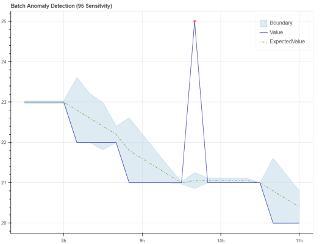

<head>
  <meta name="twitter:url" content="https://julyot.dev/blog/julyot-day5-embedded" />
  <meta name="twitter:title" content="Altair IoT Everywhere!" />
  <meta name="twitter:description" content="Altair Everywhere scale IoT apps from embedded to desktop" />
  <meta name="twitter:image" content="https://julyot.dev/img/png/JulyOT-banner-5-altair.png" />
  <meta name="twitter:card" content="summary_large_image" />
  <meta name="twitter:creator" content="@dglover" />
  <meta name="twitter:site" content="@AzureAdvocates" />
  <link rel="canonical" href="https://julyot.dev/blog/julyot-day5-embedded" />
</head>

> Welcome to Day 5 of **#JulyOT**!!

_The goal of the cloud-connected Altair project is to provide a unique blend of [computing history](https://en.wikipedia.org/wiki/Retrocomputing) with modern cloud computing. You'll learn about computing fundamentals, software development, and modern IoT, Data, and AI cloud services that address today's real-world IT challenges._

## Run Altair Everywhere

The Altair Everywhere project is tested and runs on the following platforms:

1. On a [POSIX](https://en.wikipedia.org/wiki/POSIX) compatible operating system including Linux, Windows with [WSL 2](https://docs.microsoft.com/windows/wsl/install?wt.mc_id=eventspg_16482_webpage_reactor), macOS on Apple Silicon and Intel.
1. [Raspberry Pi](https://www.raspberrypi.org/), models, Zero 1 & 2, 2B, 3B, 3B, and 4 running Raspberry Pi OS.

    | Raspberry Pi with Pi Sense HAT  | Raspberry Pi Sense HAT |
    |--|--|
    |  |  |

1. [Azure Sphere Avnet and Seeed Developer Kits](https://azure.microsoft.com/services/azure-sphere/) running embedded Linux.

    | Azure Sphere with the Altair front panel kit | MikroE Retro Click |
    |--|--|
    |  |  |

## What We'll Cover

The Altair project can be viewed through three lenses:

1. Learn how to develop multithreaded event-driven IoT C applications that scale from embedded [microcontrollers](https://en.wikipedia.org/wiki/Microcontroller) to [Raspberry Pis](https://en.wikipedia.org/wiki/Raspberry_Pi), to desktop-class computers.
1. A fantastic safe way to explore Intel 8080 machine-level programming and Assembly programming, along with C and BASIC development.
1. If you are interested in retro gaming, chill out playing retro games from yesteryear.

## Cloud services integration

Optionally, the project integrates free weather and pollution cloud services from Open Weather Map, Azure IoT Central, and Azure Anomaly Detection Cognitive Service. The following reports were generated from data published by the Altair emulator using data sourced from Open Weather Map.

| IoT Central Sydney pollution report | Azure Anomaly Detection report|
|------|-----|
|  |  |

## Get Started

Head to the [Altair Everywhere](https://github.com/gloveboxes/Altair8800.Emulator.UN-X/wiki) repo, get started, have some fun, learn new skills, and impress your friends and family :)

## Altair History

[Altair 8800 image attribution - Smithsonian Museum](https://commons.wikimedia.org/wiki/File:Altair_8800,_Smithsonian_Museum.jpg)

The Altair 8800 was built on the [Intel 8080](https://en.wikipedia.org/wiki/Intel_8080?azure-portal=true) CPU, the second 8-bit microprocessor manufactured by Intel in 1974. By today's standards, it's a simple CPU design, perfect for learning computing fundamentals because of its small instruction set.

The original Altair 8800 was programmed by setting switches on the front panel. It was a painstaking, error-prone process to load and run a program. The Altair 8800 had a series of LEDs and switches that you used to load apps and determine the state of the Altair.

You could save and load applications from a paper tape reader connected to the Altair 8800. As the Altair 8800 grew in popularity, more options became available. You could attach a keyboard, a computer monitor, and disk drives, a more reliable way to save and load applications.
