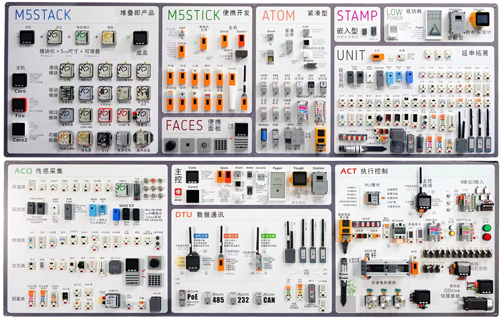
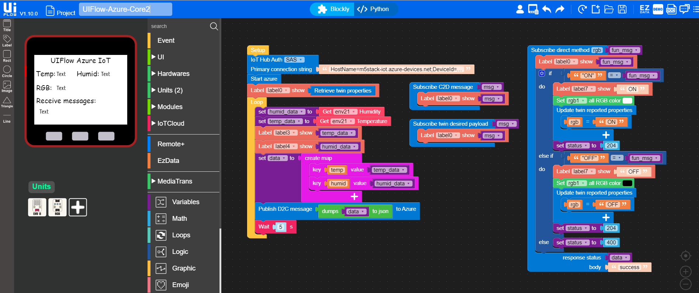
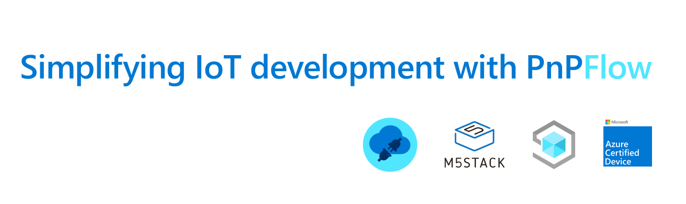
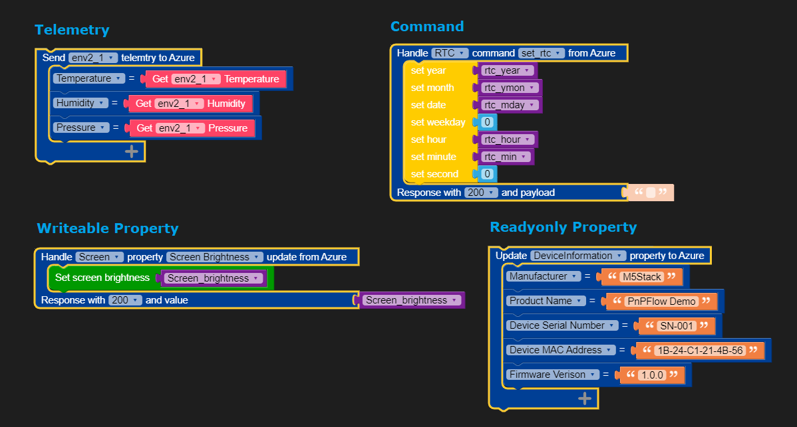

<head>
  <meta name="twitter:url" content="https://julyot.dev/blog/07-pnpflow" />
  <meta name="twitter:title" content="Plug and Play IoT device development with PnPFlow" />
  <meta name="twitter:description" content="Plug and Play IoT device development with PnPFlow" />
  <meta name="twitter:image" content="https://julyot.dev/img/png/JulyOT-banner-1-nanoframework.png" />
  <meta name="twitter:card" content="summary_large_image" />
  <meta name="twitter:creator" content="@jimbobbennett" />
  <meta name="twitter:site" content="@AzureAdvocates" /> 
  <link rel="canonical" href="https://julyot.dev/blog/07-pnpflow" />
</head>

## What we have for you today

* [**Plug and Play on Windows**](#plug-and-play-story-on-windows)
* [**Azure IoT Plug and Play**](#azure-iot-plug-and-play)
* [**The rise of Low-code IoT development**](#the-rise-of-low-code-iot-development)
* [**About M5STACK**](#about-m5stack)
* [**What is PnPFlow?**](#what-is-pnpflow)
* [**Associated links**](#associated-links)

TODO: Insert Youtube video here.

## Plug and Play on Windows

People all love plug-and-play stuff. When you connect a printer or a U disk to a PC, they work for you immediately and never have to care whether the driver is correct and whether it requires manual configuration. Actually, there are some stories behind these experiences.

While technology brings a lot of convenience to our lives, it also brings endless mess to our developers. Initially, the operating system's support for devices and drivers requires a lot of customization, which not only reduces efficiency but also creates many incompatibility problems.

The introduction of the [Windows Plug and Play](https://docs.microsoft.com/en-us/windows-hardware/drivers/kernel/introduction-to-plug-and-play) framework solves this perfectly. Device builders, operating systems supplier and driver developers are brought together to implement the same goal. A set of rules define the experiences for device discovery, driver interface, device configuration, and user notification. When everyone communicates according to unified rules, plug-and-play become a reality, so end users can use devices without worrying about how to set up them in the first place.

## Azure IoT Plug and Play

From PC industry to IoT world, the situation becomes even more complicated. Fragmentation of IoT is a long-standing problem, with so many players involved, neither the device nor the cloud have a well-accepted standard for interoperability. Such confusion increases costs and slows down the progress of enterprise IoT deployment and digital transformation.

The [Azure IoT Plug and Play](https://docs.microsoft.com/en-us/azure/iot-develop/overview-iot-plug-and-play) is Microsoft's answer to address this issue, based on the same philosophy as Windows Plug and Plug. Building an ecosystem to provide seamless integration between off-the-shelf devices and cloud solutions to make completion of this critical step much faster.

IoT Plug and Play is based on an open modeling language [DTDL](https://github.com/Azure/opendigitaltwins-dtdl/blob/master/DTDL/v2/dtdlv2.md) that allows IoT devices to declare their capabilities to a solution out of band. At the center of IoT Plug and Play is a schema that describes device capabilities in a model file, which is a [JSON-LD](https://json-ld.org/) document. It’s structured as a set of interfaces comprised of three kinds of information that can be used to model any device:

- Telemetry (usually time-series data like temperature measurement, or events such as alerts), 
- Properties (attributes like firmware version, or long run settings like target fan speed), 
- Commands (such as reboot, open a door lock).

The modeling architecture support interfaces reuse across device capability models to facilitate collaboration and speed development.

Solutions built on Azure IoT, including Azure IoT Hub and Central, support IoT Plug and Play natively. Application developers can understand the capabilities and data format of a device by retrieving and parsing the model through a Model ID and a public model repository, automatically adapting to achieve the a good visualization without any customized code.

> IoT Plug and Play is also part of [Azure Certified Device program](https://www.microsoft.com/azure/partners/azure-certified-device), which enables customer to differentiate, certify, and promote their  IoT devices work on Azure. 

## The rise of Low-code IoT development

The benefits of plug-and-play go beyond just connecting two systems, it is also applicable and popular in accelerating IoT hardware and software development.

To achieve hardware plug-and-play, the interface should first be standardized and the hardware needs to be modularized. Just like building Lego blocks, various prototypes can be easily designed. From the rise of Arduino to various open-source hardware, such as Microsoft [Jacdac](https://microsoft.github.io/jacdac-docs/), device manufacturers have always hoped to find a way to make hardware connections less expensive and more convenient.

From a software development perspective, graphical programming and low-code development are very popular in some scenarios, [NodeRed](https://nodered.org/) and Microsoft [MakeCode](https://www.microsoft.com/en-us/makecode) are two good examples of them. Anyone can quickly implement business logic and build prototypes without requiring too much professional knowledge and programming skills. Countless innovative projects around the world use these platforms to solve real problems every year.

Our protagonist today: M5STACK, combined with the two characteristics of modular hardware and low-code graphic programming, really makes IoT development quick and easy.

## About M5STACK

[M5STACK](https://m5stack.com/), based in Shenzhen, China, is a technology company that designs and manufactures open-source IoT development toolkit for the global market. They are also an IoT device partner of Microsoft Azure, offering IoT modules and engineering services to enterprise customers.

M5STACK build hundreds of sensors, actuators, and communication modules that can be connected through standard interfaces, these modules plug and play with their low-code graphic programming IDE: [UIFLOW](https://flow.m5stack.com), to give the best IoT project prototyping experience from entry-level hobbyist to professional developers.

In UIFLOW, user can get a sensor reading very quickly by drag and drop a single block, or implement more advanced scenarios combining several blocks to move data between an industrial network like Modbus to a internet service over TCP/IP. All these without much knowledge of how these protocols work under the hood.

M5STACK aims to cooperate with other companies to create a more open and interconnected IoT developer platform. Their [kits](https://devicecatalog.azure.com/devices/84fe4cc3-cdf1-48a1-8b58-07685890f359) were certified for Azure IoT Plug and Play. UIFLOW has advanced [Azure IoT support](https://docs.m5stack.com/en/uiflow/iotcloud/azure) built-in. Users can build a device with few clicks to able to connect to Azure IoT Hub or Azure IoT Central.

## What is PnPFlow?

Project PnPFlow is the latest collaboration between M5STACK and Azure IoT team: A better together experience for developer to build an IoT Plug and Play device without knowing the complexity of Plug and Play protocol and DTDL model. All you have to do is to drag and drop few blocks to build a business-centric application in UIFLOW, the device will be automatically provisioned on Azure IoT Central and work with template based web-UI seamlessly.

How does it work behind the scene?

1. Each supported hardware component (either a standalone hardware like a UNIT sensor, or a built-in component within Core module, such as a built-in RTC peripheral) and their capabilities is modeled as a IoT Plug and Play interface hosted on [Github](https://github.com/m5stack/M5-iot-plugandplay-models). These model files also define the data schema and semantic information for solution to use.

2. The UIFLOW has the built-in intelligence to load the predefined models, generate 'Smart' blocks to represent each telemetry, property or command operation, and associate with hardware blocks using an assignment expression. The l-value is a schema-aware object defined in the model, and the r-value is the corresponding hardware operations or a user-provided value. 

    

3. The user can pick up one or more 'Smart' blocks, manipulate them and integrate with their specific application logic. The UIFLOW will dynamically compose predefined interfaces into a single top-level device model and make sure the it is always synchronized.

4. To further improve developer experience, UIFLOW natively integrates with Azure IoT Central as a companion app, user can login to their application, create and update device template, and manage device identity without leaving UIFLOW. The IoT Central application template will be customized to reflect the device's capabilities and a default page will be created without any manual operations.

Are you exciting about Plug and Play IoT development? Get some devices from M5STACK and go to [UIFLOW](https://flow.m5stack.com) to have a try.

## Associated links

* [Build with Azure IoT Central and IoT Plug and Play](https://azure.microsoft.com/en-us/blog/build-with-azure-iot-central-and-iot-plug-and-play/)
* [Understanding IoT Plug and Play modeling](https://docs.microsoft.com/en-us/azure/iot-develop/concepts-modeling-guide)
* [UIFLOW Document](https://docs.m5stack.com/en/quick_start/m5core/uiflow)