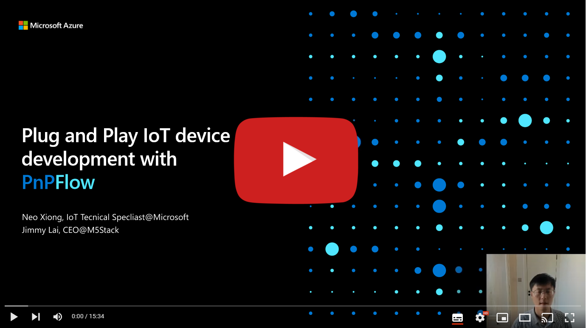

<head>
  <meta name="twitter:url" content="https://julyot.dev/blog/07-pnpflow" />
  <meta name="twitter:title" content="Plug and Play IoT device development with PnPFlow" />
  <meta name="twitter:description" content="Plug and Play IoT device development with PnPFlow" />
  <meta name="twitter:image" content="https://julyot.dev/img/png/JulyOT-banner-7-pnpflow.png" />
  <meta name="twitter:card" content="summary_large_image" />
  <meta name="twitter:creator" content="@jimbobbennett" />
  <meta name="twitter:site" content="@AzureAdvocates" />
  <link rel="canonical" href="https://julyot.dev/blog/07-pnpflow" />
</head>

## What we have for you today

* [**Plug and Play on Windows**](#plug-and-play-story-on-windows)
* [**Azure IoT Plug and Play**](#azure-iot-plug-and-play)
* [**The rise of Low-code IoT development**](#the-rise-of-low-code-iot-development)
* [**About M5STACK**](#about-m5stack)
* [**What is PnPFlow?**](#what-is-pnpflow)
* [**How does PnPFlow work**](#how-does-pnpflow-work)
* [**Associated links**](#associated-links)

## Watch the introduction to PnPFlow

## Plug and Play on Windows

Everyone loves plug-and-play. When you connect a printer or a disk to your computer, they just work, and you don't have to worry about having installing drivers or configuring devices.

The introduction of the [Windows Plug and Play](https://docs.microsoft.com/windows-hardware/drivers/kernel/introduction-to-plug-and-play?wt.mc_id=eventspg_16482_webpage_reactor) framework solved problems with installing and configuring devices. The Plug and Play framework provided a standard interface for device builders, driver developers and the operating system.

Windows Plug and Play provides a set of rules for device discovery, driver interfaces, device configuration, and user notification. When everyone communicates according to unified rules, plug-and-play become a reality, end users can use devices without worrying how to set them up.

## IoT Plug and Play

From the PC industry to the IoT world, the situation is even more complicated. Fragmentation in the IoT industry is a long-standing problem. There are many players involved, and there aren't well-accepted standards for interoperability. Complexity increases costs and slows down the progress of enterprise IoT deployment and digital transformation.

[IoT Plug and Play](https://docs.microsoft.com/azure/iot-develop/overview-iot-plug-and-play?wt.mc_id=eventspg_16482_webpage_reactor) is Microsoft's answer to IoT interoperability. Building an ecosystem to provide seamless integration between off-the-shelf devices and cloud solutions.

IoT Plug and Play is based on the open modeling language [DTDL](https://github.com/Azure/opendigitaltwins-dtdl/blob/master/DTDL/v2/dtdlv2.md) that allows IoT devices to declare their capabilities to a solution. At the center of IoT Plug and Play is a schema that describes device capabilities with a [JSON-LD](https://json-ld.org/) model document.

An IoT Plug and Play model uses the following interfaces to describe and model any device:

* Telemetry
  Usually time-series data like temperature measurements or events such as alerts).
* Properties
  Attributes like firmware version or long-running settings like target fan speed.
* Commands
  For example, reboot a device, or open a door lock.

The modeling architecture supports interface reuse across device capability models to facilitate collaboration and speed development.

Solutions built on Azure IoT, including Azure IoT Hub and Central, support IoT Plug and Play natively. Application developers can also build IoT Plug and Play enabled solutions that adapt to IoT devices by parsing their DTDL models.

> IoT Plug and Play is also part of the [Azure Certified Device program](https://www.microsoft.com/azure/partners/azure-certified-device?wt.mc_id=eventspg_16482_webpage_reactor) which enables device developers to differentiate and certify their IoT devices and a central catalogue for customers to discover IoT devices.

## The rise of Low-code IoT development

The benefits of plug-and-play go beyond just connecting two systems, it is also useful for accelerating IoT hardware and software development.

To achieve hardware plug-and-play, the interface should be standardized and the hardware should be modular. Just like Lego building blocks, various prototypes can be easily designed. From the rise of Arduino to various open-source hardware, such as Microsoft [Jacdac](https://microsoft.github.io/jacdac-docs/), device manufacturers want ways to make hardware connections less expensive and more convenient.

From a software development perspective, graphical programming and low-code development are very popular. [NodeRed](https://nodered.org/) and Microsoft [MakeCode](https://www.microsoft.com/makecode?wt.mc_id=eventspg_16482_webpage_reactor) are two great examples. Anyone can quickly implement business logic and build prototypes without requiring deep professional knowledge and programming skills. Countless innovative projects around the world use these platforms to solve real problems.

## Introducing M5STACK

M5STACK is a great example of a company that builds products that are both modular and use low-code graphic programming, this makes IoT development easier.

[M5STACK](https://m5stack.com/), based in Shenzhen, China, is a technology company that designs and manufactures open-source IoT development devices for the global market. They're also an IoT device partner of Microsoft Azure, offering IoT modules and engineering services to enterprise customers.

M5STACK builds hundreds of sensors, actuators, and communication modules that can be connected through standard interfaces. These modules plug and play with the [UIFLOW](https://flow.m5stack.com) low-code graphical programming IDE to give the best IoT project prototyping experience from entry-level hobbyists to professional developers.

With UIFLOW, a user builds a solution with single blocks, or they can implement more advanced scenarios by combining several blocks. For example, blocks can be combined to move data between industrial networks like Modbus to internet services over TCP/IP without requiring a deep understanding of these protocols.

M5STACK aims to cooperate with other companies to create a more open and interconnected IoT developer platform. Their [kits](https://devicecatalog.azure.com/devices/84fe4cc3-cdf1-48a1-8b58-07685890f359) are certified for Azure IoT Plug and Play. UIFLOW has advanced [Azure IoT support](https://docs.m5stack.com/en/uiflow/iotcloud/azure) built-in.  Users can build a device with just a few clicks to connect to Azure IoT Hub or Azure IoT Central.

## What is PnPFlow?

Project PnPFlow is the latest collaboration between M5STACK and the Azure IoT team. A better together experience for developer to build an IoT Plug and Play device without knowing the complexity of Plug and Play protocol and DTDL model. All you have to do is to drag and drop blocks to build a business-centric application in UIFLOW. The device will be automatically provisioned on Azure IoT Central and seamlessly will work with IoT Central template based web-UI .

## How does PnPFlow work?

1. Each supported hardware component, be it standalone hardware like a UNIT sensor, or a built-in Core module component, such as a built-in RTC peripheral, have capabilities modeled as an IoT Plug and Play interface. The models are hosted on [Github](https://github.com/m5stack/M5-iot-plugandplay-models).

2. The UIFLOW has built-in intelligence to load predefined models, generate 'Smart' blocks to represent each telemetry, property, or command operation, and associate with hardware blocks using an assignment expression. The l-value is a schema-aware object defined in the model, and the r-value is the corresponding hardware operations or a user-provided value.

    

3. The user can choose one or more 'Smart' blocks, manipulate them and integrate them with custom application logic. The UIFLOW will dynamically compose predefined interfaces into a single top-level device model.

4. To further improve developer experience, UIFLOW  natively integrates with Azure IoT Central. Users can log in to their IoT Central applications, create and update device templates, and manage device identities without leaving UIFLOW. The IoT Central application template will be customized to reflect the device's capabilities and a default page will be automatically generated.

    

Are you exciting about Plug and Play IoT development? Get some devices from M5STACK and go to [UIFLOW](https://flow.m5stack.com) to test it out.

## Associated links

* [Build with Azure IoT Central and IoT Plug and Play](https://azure.microsoft.com/en-us/blog/build-with-azure-iot-central-and-iot-plug-and-play/?wt.mc_id=eventspg_16482_webpage_reactor)
* [Understanding IoT Plug and Play modeling](https://docs.microsoft.com/azure/iot-develop/concepts-modeling-guide?wt.mc_id=eventspg_16482_webpage_reactor)
* [M5STACK UIFLOW Documentation](https://docs.m5stack.com/en/quick_start/m5core/uiflow)
