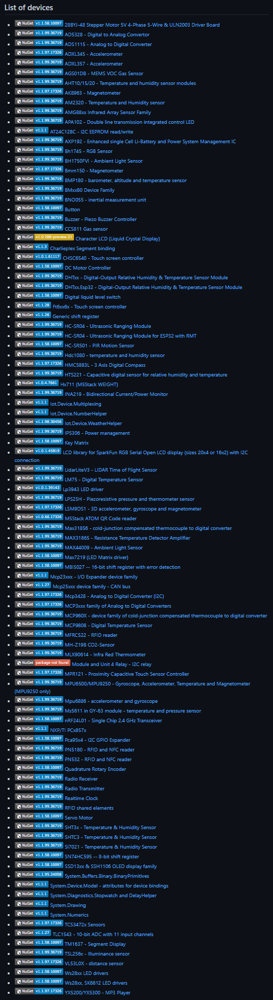

# GPIO, I2C, SPI, PWM, ADC, DAC, Serial and more!

.NET nanoFramework has support for GPIO, I2C, SPI, PWM, ADC, DAC, Serial, 1-Wire. Also the API are aligned with [.NET IoT](https://github.com/dotnet/iot/) making it easy for code reuse between development on a Raspberry Pi with .NET 6.0 and an MCU running .NET nanoFramework.

A comparison on how to reuse code and the differences between .NET IoT and .NET nanoFramework is available [here](https://github.com/dotnet/samples/tree/main/iot/dotnet-iot-and-nanoframework).

There are dedicated classes with detailed documentation and samples for each of them:

- General Purpose Input and Output (GPIO): [System.Device.Gpio](https://github.com/nanoframework/System.Device.Gpio) and associated documentation for the [class library](https://docs.nanoframework.net/api/System.Device.Gpio.html)

    And a code spinet to blink a led:

    ```csharp
    // Creates a GPIO controller
    GpioController controller = new();
    // Open the pin
    GpioPin led = controller.OpenPin(12, PinMode.Output);
    // Change the value of the pin. Equivalent code as the next line: controller.Write(12, PinValue.Low)
    led.Write(PinValue.Low);
    while (true)
    {
        // Toggle the value of the pin
        led.Toggle();
        Thread.Sleep(125);
    }
    ```
    
    [Blink your first led](https://github.com/nanoframework/Samples/blob/main/samples/Blinky)! [GPIO sample pack](https://github.com/nanoframework/Samples/blob/main/samples/Gpio) including event management.

- Serial Peripheral Interface (SPI): [System.Device.Spi](https://github.com/nanoframework/System.Device.Spi)and associated document for the [class library](https://docs.nanoframework.net/api/System.Device.Spi.html)

    To create a SpiDevice, you need to follow this pattern:

    ```csharp
    SpiDevice spiDevice;
    SpiConnectionSettings connectionSettings;
    // Note: the ChipSelect pin should be adjusted to your device, here 12
    // You can adjust as well the bus, here 1 for SPI1
    connectionSettings = new SpiConnectionSettings(1, 12);
    spiDevice = SpiDevice.Create(connectionSettings);
    ```

    You can write a SpanByte like this:

    ```csharp
    SpanByte writeBuffer = new byte[2] { 42, 84 };
    spiDevice.Write(writeBuffer);
    ```

    You can write a ushort array like this:

    ```csharp
    ushort[] writeBuffer = new ushort[2] { 4200, 8432 };
    spiDevice.Write(writeBuffer);
    ```

    You can write single bytes:
    ```csharp
    spiDevice.WriteByte(42);
    ```

    Read operations are similar:

    ```csharp
    SpanByte readBuffer = new byte[2];
    // This will read 2 bytes
    spiDevice.Read(readBuffer);
    ushort[] readUshort = new ushort[4];
    // This will read 4 ushort
    spiDevice.Read(readUshort);
    // read 1 byte
    byte readMe = spiDevice.ReadByte();
    ```

    For full transfer, you need to have 2 arrays of the same size and perform a full duplex transfer:

    ```csharp
    SpanByte writeBuffer = new byte[4] { 0xAA, 0xBB, 0xCC, 0x42 };
    SpanByte readBuffer = new byte[4];
    spiDevice.TransferFullDuplex(writeBuffer, readBuffer);
    // Same for ushirt arrays:
    ushort[] writeBuffer = new ushort[4] { 0xAABC, 0x00BB, 0xCC00, 0x4242 };
    ushort[] readBuffer = new ushort[4];
    spiDevice.TransferFullDuplex(writeBuffer, readBuffer);
    ```

    More [System.Device.Spi samples](https://github.com/nanoframework/Samples/blob/main/samples/SPI).

- Inter-Integrated Circuit (I2C): [System.Device.I2c](https://github.com/nanoframework/System.Device.I2c)and associated document for the [class library](https://docs.nanoframework.net/api/System.Device.I2c.html)

    Here is a short example on how to use I2C:

    ```csharp
    // In this case we are opening the bus 1 and the device address 0x42
    I2cDevice i2c = new(new I2cConnectionSettings(1, 0x42));
    // We write a byte, in this case 0x07, we can write a SpanByte as well
    var res = i2c.WriteByte(0x07);
    // A successfull write will be: 0x10 Write: 1, transferred: 1
    // A non successful one: 0x0F Write: 4, transferred: 0
    Debug.Write($"0x{i:X2} Write: {res.Status}, transferred: {res.BytesTransferred}");
    // We're now trying to read 2 bytes
    SpanByte span = new byte[2];
    res = i2c.Read(span);
    // A successfull write will be: Read: 1, transferred: 1
    // A non successfull one: Read: 2, transferred: 0
    Debug.WriteLine($", Read: {res.Status}, transferred: {res.BytesTransferred}");
    ```

    [I2C sample sample pack](https://github.com/nanoframework/Samples/blob/main/samples/I2C) containing as well [I2C GPS sample](https://github.com/nanoframework/Samples/blob/main/samples/I2C/System.Device.I2c/GPS) and an [I2C Scanner sample](https://github.com/nanoframework/Samples/blob/main/samples/I2C/NanoI2cScanner).

- Digital-to-analog converter (DAC): [System.Device.Dac](https://github.com/nanoframework/System.Device.Dac)and associated document for the [class library](https://docs.nanoframework.net/api/System.Device.Dac.html)

    A simple example for DAC is to create a specific sinus wave for example:

    ```csharp
    // Gets the controller
    DacController dac = DacController.GetDefault();
    // Open channel 0
    DacChannel dacChannel = dac.OpenChannel(0);
    // Gete DAC resolution
    dacResolution = dac.ResolutionInBits;

    int upperValue, midRange;
    double radian = 0;
    // Gets upper value from DAC resolution
    upperValue = (int)Math.Pow(2.0, dacResolution);

    // compute a reasonable increment value from the resolution
    float increment = maxRads / (dacResolution * 10);
    midRange = upperValue / 2;

    while(true)
    {
        // because the DAC can't output negative values
        // we have to offset the sine wave to half the DAC output range
        uint value = (uint)((Math.Sin(radian) * (midRange - 1)) + midRange);
        //Output the current value to console when in debug.
        Debug.WriteLine($"DAC SineWave output current value: {value}");
        // output to DAC
        channel.WriteValue((ushort)value);
        // increment angle
        radian += increment;
        if (radian >= maxRads)
        {
            // tweak the value so it doesn't overflow the DAC
            radian = 0;
        }

        // Wait 5 milliseconds before the next point
        Thread.Sleep(5);
    }
    ```

    [Digital Analog Converter samples](https://github.com/nanoframework/Samples/blob/main/samples/DAC).

- Analog-to-digital converter (ADC): [System.Device.Adc](https://github.com/nanoframework/System.Device.Adc) and associated document for the [class library](https://docs.nanoframework.net/api/System.Device.Adc.html)

    Each target device has an ADC Controller. To read a channel, first, instantiate the ADC controller and open the channel you want to read from. To read the raw value from an ADC channel, it's a simple matter of calling the Read() method on an open channel.

    ```csharp
    AdcController adc1 = new AdcController();
    AdcChannel channel0 = adc1.OpenChannel(0);
    int myAdcRawvalue = channel0.ReadValue();
    ```

    To find details about the ADC controller, query the ADC controller properties, like this.

    ```csharp
    // get maximum raw value from the ADC controller
    int max1 = adc1.MaxValue;
    // get minimum raw value from the ADC controller
    int min1 = adc1.MinValue;
    // find how many channels are available 
    int channelCount = adc1.ChannelCount;
    // resolution provided by the ADC controller
    int adcResolution = adc1.ResolutionInBits;
    ```

    [Analogic/Digital converter sample](https://github.com/nanoframework/Samples/blob/main/samples/ADC).

- Pulse-width Modulation (PWM): [System.Device.Pwm](https://github.com/nanoframework/System.Device.Pwm)and associated document for the [class library](https://docs.nanoframework.net/api/System.Device.Pwm.html)

    You can create a PWM channel from a pin number. For an ESP32 device, allocate the pin, for an STM32 device ensure the selected pin is PWM enabled.

    ```csharp
    // Case of ESP32, you need to set the pin function, in this example PWM3 for pin 18:
    Configuration.SetPinFunction(18, DeviceFunction.PWM3);
    PwmChannel pwmPin = PwmChannel.CreateFromPin(18, 40000);
    // You can check then if it has created a valid one:
    if (pwmPin != null)
    {
        // You do have a valid one
    }
    ```

    You can adjust the duty cycle by using the property:

    ```csharp
    pwmPin.DutyCycle = 0.42;
    ```

    The duty cycle goes from 0.0 to 1.0.

    It is recommended to set the frequency when creating the PWM Channel. You can technically change it at any time but keep in mind some platforms may not behave properly when adjusting this element.

    Alternatively, if you know the chip/timer Id and the channel then follow this example:

    ```csharp
    PwmChannel pwmPin = new(1, 2, 40000, 0.5);
    ```

    More on [System.Device.Pwm sample](https://github.com/nanoframework/Samples/blob/main/samples/PWM/System.Device.Pwm).

- Serial Port: [System.IO.Ports](https://github.com/nanoframework/System.IO.Ports)and associated documentation for the [class library](https://docs.nanoframework.net/api/System.IO.Ports.html)

    Serial ports are often used to communicate with sensors. The `SerialPort` must be first opened before it can be used. The serial port can also be closed, when the serial port is disposed, the `SerialPort` will perform the close operation regardless of any ongoing receive or transmit operations.

    ```csharp
    // You can specify baud rate, parity, bit stops and number of bits as well:
    var port = new SerialPort("COM2");
    port.Open();
    // Do a lot of things here, write, read
    port.Close();
    ```

    There are functions to read and write, some are byte related, others string related. Note that string functions will use UTF8 `Encoding` charset.

    Example of sending and reading byte arrays:

    ```csharp
    byte[] toSend = new byte[] { 0x42, 0xAA, 0x11, 0x00 };
    byte[] toReceive = new byte[50];
    // this will send the 4 bytes:
    port.Write(toSend, 0, toSend.Length);
    // This will only send the bytes AA and 11:
    port.Write(toSend, 1, 2);
    // This will check then number of available bytes to read
    var numBytesToRead = port.BytesToRead;
    // This will read 50 characters:
    port.Read(toReceive, 0, toReceive.Length);
    // this will read 10 characters and place them at the offset position 3:
    port.Read(toReceive, 3, 10);
    // Note: in case of time out while reading or writing, you will receive a TimeoutException
    // And you can as well read a single byte:
    byte oneByte = port.ReadByte();
    ```

    Sending and receiving string example:

    ```csharp
    string toSend = "I ❤ nanoFramework";
    port.WriteLine(toSend);
    // this will send the string encoded finishing by a new line, by default `\n`
    // You can change the new line to be anything:
    port.NewLine = "❤❤";
    // Now it will send 2 hearts as the line ending `WriteLine` and will use 2 hearts as the terminator for `ReadLine`.
    // You can change it back to the `\n` default at anytime:
    port.NewLine = SerialPort.DefaultNewLine; // default is "\n"
    // This will read the existing buffer:
    string existingString = port.ReadExisting();
    // Note that if it can't properly convert the bytes to a string, you'll get an exception
    // This will read a full line, it has to be terminated by the NewLine string.
    // If nothing is found ending by the NewLine in the ReadTimeout time frame, a TimeoutException will be raised.
    string aFullLine = port.ReadLine();
    ```

    SerialPort supports events when characters are received.

    ```csharp
        // Subscribe to the event
        port.DataReceived += DataReceivedNormalEvent;

        // When you're done, you can as well unsubscribe
        port.DataReceived -= DataReceivedNormalEvent;

    private void DataReceivedNormalEvent(object sender, SerialDataReceivedEventArgs e)
    {
        var ser = (SerialPort)sender;
        // Now you can check how many characters are available, read a line for example
        var numBytesToRead = port.BytesToRead;
        string aFullLine = ser.ReadLine();
    }
    ```

    There are more supported. Check it in the [System.IO.Ports serial Communication sample](https://github.com/nanoframework/Samples/blob/main/samples/SerialCommunication).

- One Wire or 1-Wire: [nanoFramework.Device.OneWire]https://github.com/nanoframework/nanoFramework.Device.OneWire)and associated document for the [class library](https://docs.nanoframework.net/api/nanoFramework.Device.OneWire.html)

    To connect to a 1-Wire bus, first, instantiate an OneWireHost object, then perform operations with the connected devices.

    ```csharp
    OneWireHost _OneWireHost = new OneWireHost();
    ```

    To find the first device connected to the 1-Wire bus, and perform a reset on the bus before performing the search, call the `FindFirstDevice` method:

    ```csharp
    _OneWireHost.FindFirstDevice(true, false);
    ```

    To write a byte with the value 0x44 to the connected device:

    ```csharp
    _OneWireHost.WriteByte(0x44);
    ```

    To get a list with the serial number of all the 1-Wire devices connected to the bus:

    ```csharp
    var deviceList = _OneWireHost.FindAllDevices();

    foreach(byte[] device in deviceList)
    {
        string serial = "";

        foreach (byte b in device)
        {
            serial += b.ToString("X2");
        }

        Console.WriteLine($"{serial}");
    }
    ```

    Check out the [1-Wire sample](https://github.com/nanoframework/Samples/blob/main/samples/1-Wire).

> Note: devices have different ways to name pins and set them up. It is important to check the default configuration, especially for any STM32 devices. ESP32 devices can be set dynamically. A NuGet package is available for this [nanoFramework.Hardware.Esp32](https://github.com/nanoframework/nanoFramework.Hardware.Esp32). In that case, you would have to set the pins if they don't match your [defaults pins](https://docs.nanoframework.net/content/esp32/esp32_pin_out.html).

## IoT Repository and advanced bindings

The alignment between .NET IoT and .NET nanoFramework allows code reuse between the different platforms. While it's not technically possible to have the same NuGet for both platforms, reusing API and code is possible. A lot of work and effort has been put in place to facilitate the creation of individual NuGet packages for almost all of the .NET IoT bindings! The [IoT Device repository](https://github.com/nanoframework/nanoFramework.IoT.Device) contains all the tools and the code for all of the available bindings.

The .NET nanoFramework does not *yet* support Generics or Linq, and in places, compromises have been made so the framework fits on constrained devices. [This page](https://docs.nanoframework.net/content/architecture/simplifications-and-trade-offs.html) explains most of them.

Tools to help in the migration have been built to automate some of the migration and [initial work started back in May 2021](https://www.nanoframework.net/net-iot-bindings-available/). Now more than 98 bindings are available, some specific for MCU and optimized for a specific platform like ESP32. .NET IoT also benefited from this work as some of those new bindings have been migrated back to .NET IoT.

Here is a view of the devices!

[](https://github.com/nanoframework/nanoFramework.IoT.Device#list-of-devices)

Each binding has a sample. All is well organized and you'll find those in the `/devices/BindingName/samples` directory. And as an example, here is how you can use a BMP280:

```csharp
// bus id on the MCU
const int busId = 1;

I2cConnectionSettings i2cSettings = new(busId, Bmp280.DefaultI2cAddress);
I2cDevice i2cDevice = I2cDevice.Create(i2cSettings);
using var i2CBmp280 = new Bmp280(i2cDevice);

// set higher sampling
i2CBmp280.TemperatureSampling = Sampling.LowPower;
i2CBmp280.PressureSampling = Sampling.UltraHighResolution;

// Perform a synchronous measurement
var readResult = i2CBmp280.Read();

// Print out the measured data
Debug.WriteLine($"Temperature: {readResult.Temperature?.DegreesCelsius:N1}\u00B0C");
Debug.WriteLine($"Pressure: {readResult.Pressure?.Hectopascals:N2}hPa");
```

Note the usage of [UnitsNet](https://github.com/angularsen/UnitsNet). UnitsNet is used to facilitate unit conversions. We've implemented the most popular unit conversions and provided them as NuGet packages. This simplifies development, for example, you don't need to worry about providing a temperature value in Celsius or Fahrenheit. It's just a temperature, the developer can choose the unit to display. The rest of the magic is done for you.
