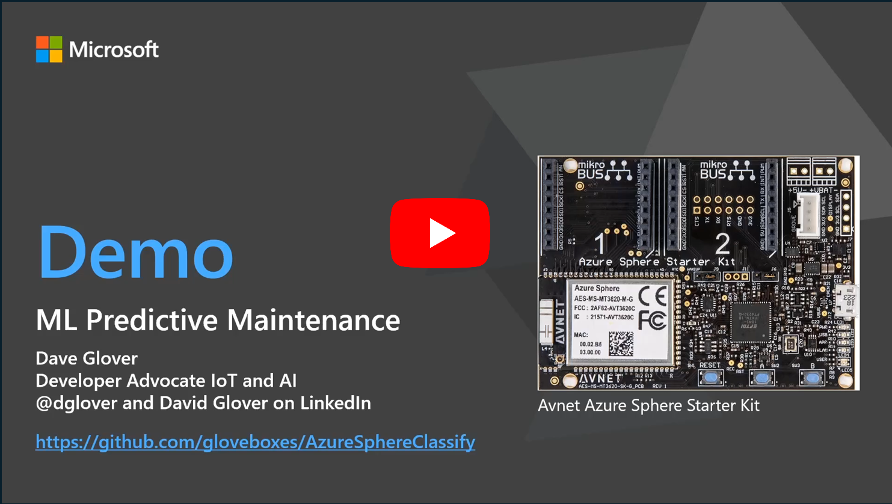
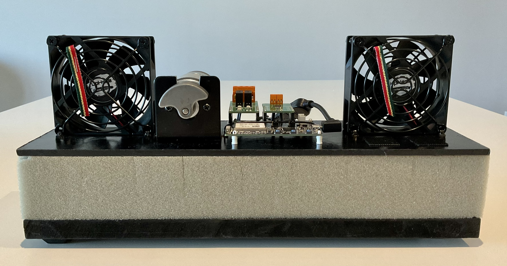

<head>
  <meta name="twitter:url" content="https://julyot.dev/blog/julyot-day12-embedded" />
  <meta name="twitter:title" content="AI-powered predictive maintenance with Azure Sphere" />
  <meta name="twitter:description" content="AI-powered predictive maintenance can help identify a faulty machine before a real problem occurs, reducing maintenance costs, improving availability and customer satisfaction" />
  <meta name="twitter:image" content="" />
  <meta name="twitter:card" content="summary_large_image" />
  <meta name="twitter:creator" content="@nitya" />
  <meta name="twitter:site" content="@AzureAdvocates" />
  <link rel="canonical" href="https://julyot.dev/blog/julyot-day12-embedded" />
</head>

> Welcome to `Day 12 of **#JulyOT**!!

_HVAC ([Heating, ventilation, and air conditioning](https://en.wikipedia.org/wiki/Heating,_ventilation,_and_air_conditioning)) units regulate our home and workplace environments. HVAC systems are ideal candidates for predictive maintenance, as they require regular costly maintenance._

## Watch the 10-minute end-to-end demonstration

## Machine Learning on Embedded Hardware

AI-powered predictive maintenance can help identify a faulty machine before a real problem occurs, reducing maintenance costs, improving availability and customer satisfaction. The advantages of predictive maintenance include:

- Reduced carbon footprint. Keeping equipment running well has straightforward benefits for operating efficiency, but we should also ensure our processes are efficient. Fault monitoring can generate high volumes of low-value data. Sending this data to cloud systems consumes power and network resources. Running an ML model on embedded hardware consumes less electricity and network resources. Only predicted maintenance events get sent to the backend systems. Disabling network interfaces (for example, Wi-Fi) can further reduce power consumption until a high-value predictive maintenance event occurs.
- Access to better data for faster fault resolution.
- Low latency response to system faults. There are fault monitoring use cases that require immediate action to shut down a system. Sending fault monitoring data to cloud systems for processing might be too slow, further damaging the machine.

## Predictive Maintenance on Azure Sphere

Azure Sphere is a secure embedded platform that is ideal for quickly developing an IoT system. By providing a platform meeting all [7 properties of highly secured devices](https://www.microsoft.com/en-us/research/wp-content/uploads/2017/03/SevenPropertiesofHighlySecureDevices.pdf), Azure Sphere eliminates the need to be a hardware, OS, and security expert. These seven properties make Azure Sphere ideal for running and updating ML models. You don’t want to solve one problem (equipment operation) and introduce a larger one (security).

You can deploy up to 3 custom apps on Azure Sphere, including two ML workloads on the low-power real-time cores. The predictive maintenance solution runs a continuous movement classification TinyML model on one of the Azure Sphere real-time cores. When the TinyML model detects movement, for example, a rattle, or a faulty motor bearing, an event is sent to the predictive maintenance app running on the high-level core. The predictive maintenance app then powers up the network connection and sends the event to Azure IoT Central. Azure IoT Central exports the predictive maintenance event to a Logic App, which generates a message destined for Microsoft Teams.

The beauty of this solution is that you are combining building blocks. You don’t need to be a security expert, Azure Sphere has got you covered, Edge Impulse simplifies model development, and IoT Central, Logic Apps, and Microsoft Teams are low code offerings making it easier to pull everything together.

## Get Started

Head to the [AI-powered Predictive Maintenance](https://github.com/gloveboxes/AzureSphereMLPredictiveMaintenanceEW) repo to get started.
