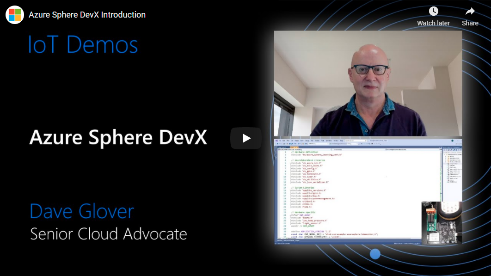

<head>
  <meta name="twitter:url" content="https://julyot.dev/blog/julyot-day19-embedded" />
  <meta name="twitter:title" content="Powering Azure Sphere C Development with DevX" />
  <meta name="twitter:description" content="Azure Sphere DevX is an Open-Source community-driven library that is based on the GitHub Azure Sphere samples and from real-life experiences building Azure Sphere applications." />
  <meta name="twitter:image" content="" />
  <meta name="twitter:card" content="summary_large_image" />
  <meta name="twitter:creator" content="@nitya" />
  <meta name="twitter:site" content="@AzureAdvocates" />
  <link rel="canonical" href="https://julyot.dev/blog/julyot-day19-embedded" />
</head>

> Welcome to `Day 19 of **#JulyOT**!!

_Azure Sphere is a unique highly secure IoT platform. You focus on your solution, Azure Sphere deals with security, identity, certificates, reporting, tracking emerging attack vectors, mitigating, updating the platform, and application distribution to protect your solutions, customers, and reputations._

I started my Azure Sphere journey 2 years ago. I’d done plenty of embedded development, but I quickly realized there was a lot to learn about Azure Sphere. If this sounds like your journey, then do check out the “[Combining Azure Sphere IoT security with Azure RTOS real-time capabilities](https://techcommunity.microsoft.com/t5/internet-of-things/combining-azure-sphere-iot-security-with-azure-rtos-real-time/ba-p/1992869)” article. There are links to the Azure Sphere developer Learning paths for IoT Hub and IoT Central.

## Azure Sphere DevX

Azure Sphere DevX is an Open-Source community-driven library that is based on the GitHub Azure Sphere samples and from real-life experiences building Azure Sphere applications. Community contributions are very welcome.

The DevX library accelerates your development and will help to improve your developer experience building Azure Sphere applications. The DevX library addresses many common Azure Sphere scenarios, it will help reduce the amount of code you write and improve readability and long-term application maintenance.

The DevX library addresses many common Azure Sphere scenarios including the following:

1. Azure IoT Messaging:
Implements connection management and simplifies sending messages along with application and content properties metadata.
1. Azure IoT Hub Device Twins:
Handles Device Twin JSON serialization and deserialization along with a type system to validate data types received and sent.
1. Direct methods:
Simplifies in-bound direct methods message processing and passes direct method payload to the associated direct method handler.
1. Intercore messaging:
Provides a context model to simplify the passing of messages between high-level and real-time application cores.
1. Event timers:
Simplified API for all common Event Timer scenarios.
1. Deferred updates:
You focus on when you want application and OS updates to occur rather than how to defer updates.
1. Async events:
Async events enable you to marshal calls from one thread to another for event-driven applications.

## Get Started

Visit the [Azure Sphere DevX library Wiki](https://github.com/Azure-Sphere-DevX/AzureSphereDevX.Examples/wiki) to learn more.
