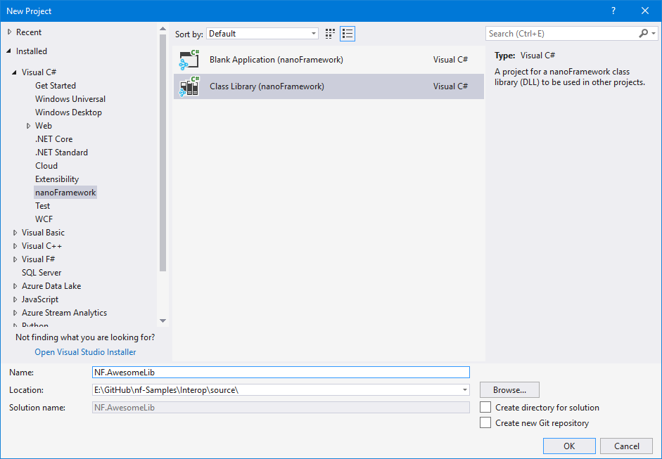
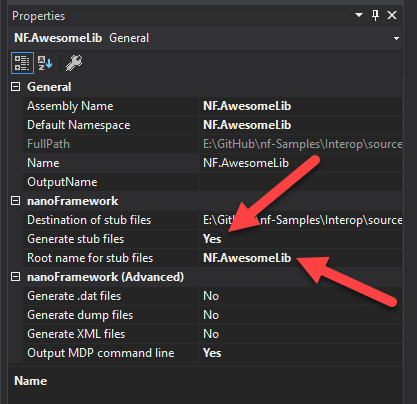
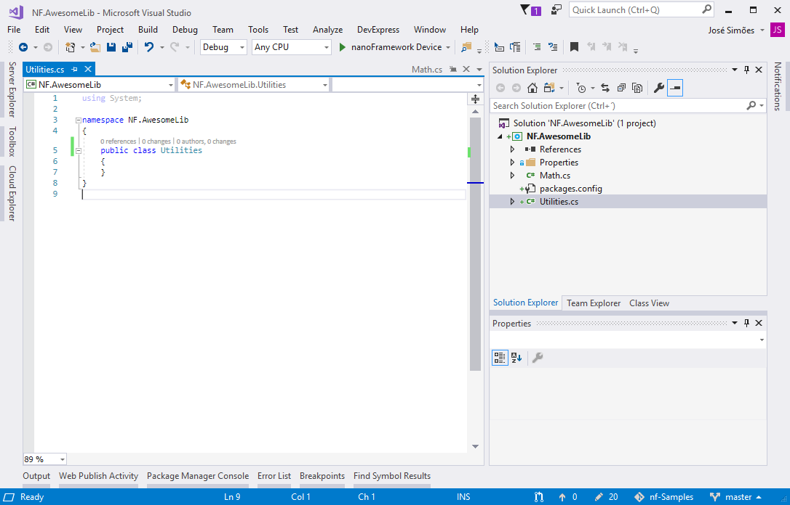
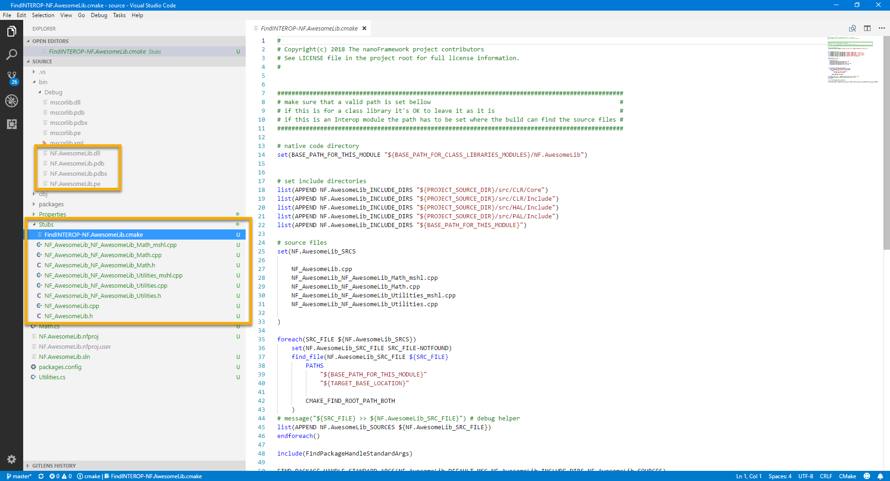
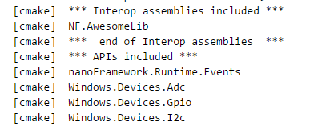
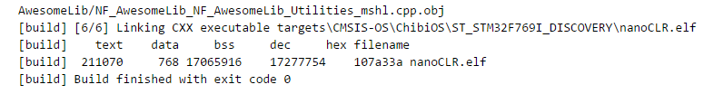
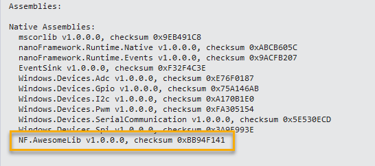
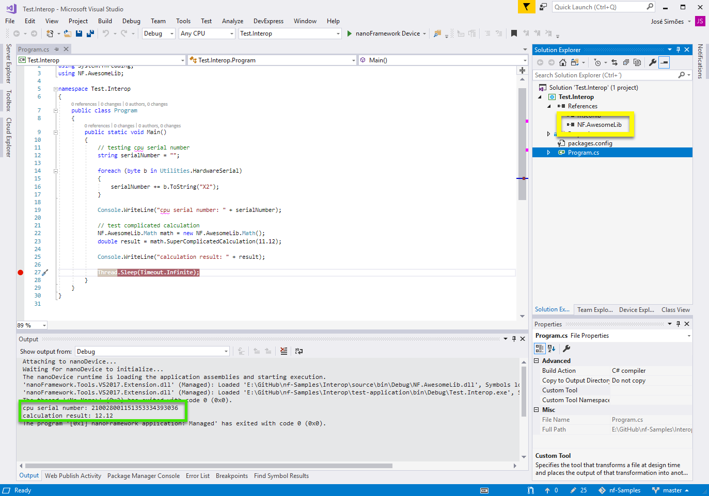

<head>
  <meta name="twitter:url" content="https://julyot.dev/blog/22-nano-framework" />
  <meta name="twitter:title" content="Building .NET nanoFramework and interoperability" />
  <meta name="twitter:description" content="Building .NET nanoFramework and interoperability" />
  <meta name="twitter:image" content="https://julyot.dev/img/png/JulyOT-banner-22-nanoframework.png" />
  <meta name="twitter:card" content="summary_large_image" />
  <meta name="twitter:creator" content="@Jose_Simoes" />
  <meta name="twitter:site" content="@AzureAdvocates" /> 
  <link rel="canonical" href="https://julyot.dev/blog/22-nano-framework" />
</head>

> Welcome to Day 22 of **#JulyOT**!


## Building .NET nanoFramework

You can build your image for an MCU with .NET nanoFramework. In most cases, you'll use prebuilt images for popular boards, including advanced ESP32 devices like the ones from M5Stack for which we offer [specific firmware](https://github.com/nanoframework/Home#m5stack) images and NuGets with [Board Support Packages](https://github.com/nanoframework/nanoFramework.M5Stack).

However, there are situations in which you'll want to build the image yourself. There are Developer Container images available for you to use. They contain all the toolchains and required tools. Check out the article on [using Dev Container to build targets](https://docs.nanoframework.net/content/building/using-dev-container.html). In case you prefer not to use the Dev Containers, it's possible to use a local setup too. Every step is well documented at [Building .NET nanoFramework](https://docs.nanoframework.net/content/building/index.html).

## Interop in .NET nanoFramework

.NET nanoFramework supports a _lightweight_ version of Interop which allows adding existing C/C++ code to .NET nanoFramework image. It's convenient, for example,  when you want to use a library that has been perfected over the years or when there is the need to perform processor-intensive operations that benefit from being executed directly by the CPU.

This is architected in such a way that the "foreign" code remains completely isolated from the CLR and the official libraries and drivers. With this, you can't break things upstream and it can be easily incorporated into the build process without requiring tweaks and handling complex merge operations.

Because the ultimate goal is to tap into this code from C#, there are two layers for this to happen:

* The C# library acts as a wrapper and offers the interface to the C/C++ code.
* The C/C++ code that gets called from C#.

Let's take look at how this works by creating a very simple Interop library that reads a hardware ID and performs a "complex" calculation.

## Creating the C# (managed) library

Create a new .NET nanoFramework project in Visual Studio

This is the very first step. Open Visual Studio, File, New Project.
Navigate to the C# .NET nanoFramework folder and select a Class Library project type.
For this example, we’ll call the project “NF.AwesomeLib”.



Go to the Project properties (click the project icon in the Solution Explorer and go to the Properties Window) and navigate to the nanoFramework configuration properties view. Set the “Generate stub files” option to YES and the root name to NF.AwesomeLib.



Now rename the Class1.cs that Visual Studio adds by default to Utilities.cs. Make sure that the class name inside that file gets renamed too. Add a new class named Math.cs. On both make sure that the class is public.

Your project should now look like this.



### Adding the API methods and the stubs

The next step will be adding the methods and/or properties that you want available on the C# managed API. These are the ones that will be called from a C# project referencing your Interop library.

We'll add an HardwareSerial property to the Utilities class and call the native method that supports the API at the native end. Like this.

```csharp
namespace NF.AwesomeLib
{
	public class Utilities
	{
        private static byte[] _hardwareSerial;

        /// <summary>
        /// Gets the hardware unique serial ID (12 bytes).
        /// </summary>
        public static byte[] HardwareSerial
        {
            get
            {
                if (_hardwareSerial == null)
                {
                    _hardwareSerial = new byte[12];
                    NativeGetHardwareSerial(_hardwareSerial);
                }

                return _hardwareSerial;
            }
        }

        #region Stubs 

        [MethodImpl(MethodImplOptions.InternalCall)]
        private static extern void NativeGetHardwareSerial(byte[] data);

        #endregion stubs 
    }
}
```

Note that, except for strings, you’re free to use any of the standard types in the arguments of the Interop methods. It’s OK to use arrays of those too.

A few explanations on the above:

* The property `HardwareSerial` has only a getter because we are only reading the serial from the hardware. As that can’t be written, it doesn’t make sense to provide a setter, right?
* The serial number is stored in a backing field to be more efficient. When it’s read the first time it will go and read it from the processor. On subsequent accesses that won’t be necessary.
* Note the summary comment on the property. Visual Studio uses that to generate an XML file that makes the awesome IntelliSense show that documentation on the projects referencing the library.
* The serial number of the processor is handled as an array of bytes with a length of 12. This was taken from the device manual.
* A stub method must exist to enable Visual Studio to create the placeholder for the C/C++ code. So you need to have one for each stub that is required.
* The stub methods must be implemented as an extern and be decorated with the MethodImplAttribute attribute. Otherwise, Visual Studio won’t be able to do its magic.
* You may want to find a working system for you regarding the stub naming and where you place them in the class. Maybe you want to group them in a region, or you prefer to keep them along the caller method. It will work in any of those ways, just a hint on keeping things organized.

Moving on to the Math class. We’ll now add an API method called SuperComplicatedCalculation and the respective stub. It will look like this:

```csharp
namespace NF.AwesomeLib
{
	public class Math
    {
        /// <summary>
        /// Crunches value through a super complicated and secret calculation algorithm.
        /// </summary>
        /// <param name="value">Value to crunch.</param>
        /// <returns></returns>
        public double SuperComplicatedCalculation(double value)
        {
            return NativeSuperComplicatedCalculation(value);
        }

        #region Stubs

        [MethodImpl(MethodImplOptions.InternalCall)]
        private static extern double NativeSuperComplicatedCalculation(double value);

        #endregion stubs
    }
}
```

And this is all that’s required on the managed side! Build the project and look at the project folder (using VS Code for example). This is what it will look like after a successful build:



From the top to the bottom, you can identify in the bin folder (debug or release flavor depending on your build preference) the .NET library that will be referenced in other projects. Please note that besides the .dll file there is the .xml file (the one that enables IntelliSense to do its magic), the .pdb file, and another one with a .pe extension.
When distributing the Interop library make sure that you package all four files. Failing to do so, will make Visual Studio complain that the project can’t build. You can distribute all those in a ZIP or even better, as a NuGet package.

## Working on the C/C++ (native) code

Moving to the Stubs folder we can find a bunch of files and a .cmake file. All those are required when building the nanoCLR image that will add support for your Interop library.

Look at the file names: they follow the namespace and class naming in the Visual Studio project.
Something very, very important: don’t rename or mess around with the content of those files. If you do that, you'll risk that the image build will fail or you can also end up with the Interop library not doing anything. This can be very frustrating and hard to debug. So, again, DO NOT mess around with those files!

The only exception to that will be, of course, the ones that include the stubs for the C/C++ code that we'll be adding. Those are the .cpp files that end with the class name.
In our example those are: `NF_AwesomeLib_NF_AwesomeLib_Math.cpp` and `NF_AwesomeLib_NF_AwesomeLib_Utilities.cpp`.

You’ve probably also noted that there are a couple of other files with a similar name but ending with _mshl. Those are the marshaling files that are responsible for validation, sanity checks, and marshaling the interface between the managed and native code. Those are to be left alone. Again DO NOT change them!

Let’s look at the stub file for the Utilities class. That’s the one that will read the processor serial number.

```csharp
void Utilities::NativeGetHardwareSerial( CLR_RT_TypedArray_UINT8 param0, HRESULT &hr )
{
}
```

This is an empty C++ function named after the class and the stub method that you’ve placed in the C# project.

Let’s take a moment to understand what we have here.

* The return value of the C++ function matches the type of the C# stub method. Which is void in this case.
* The first argument has a type that is mapping between the C# type and the equivalent C++ type. An array of bytes in this case.
* The last argument is an HRESULT type whose purpose is to report the result of the code execution. We’ll get back to this so don’t worry about it for now. Just understand what’s the purpose of it.

According to the programming manual STM32F4 devices have a 96 bits (12 bytes) unique serial number that is stored starting at address 0x1FFF7A10. For STM32F7 that address is 0x1FF0F420. In other STM32 series, the ID may be located at a different address. Now that we know where it is stored we can add code to read it. I’ll start with the code first and then walk through it.

```cpp
void Utilities::NativeGetHardwareSerial( CLR_RT_TypedArray_UINT8 param0, HRESULT &hr )
{
  if (param0.GetSize() < 12)
  {
    hr=CLR_E_BUFFER_TOO_SMALL;
    return;
  }
  
  memcpy((void*)param0.GetBuffer(), (const void*)0x1FFF7A10, 12);
}
```

The first if statement is a sanity check to be sure that there is enough room in the array to hold the serial number bytes. Why is this important?
Remember that here we are not in the C# world anymore where the CRL and Visual Studio take care of the hard stuff for us. In C++ things are very different! In this particular example if the caller wouldn’t have reserved the required 12 bytes in memory to hold the complete serial array when writing onto it the 12 bytes from the serial could be overwriting something that is stored in the memory space ahead of the argument address. For types other than pointers such as bytes, integers, and doubles this check is not required.

Still on the if statement you can see that if there is not enough room we can’t continue. Before the code returns we are setting hr to CLR_E_BUFFER_TOO_SMALL (that’s the argument that holds the execution result, remember?). This is to signal that something went wrong and give some clue on what that might be. There is still more to say about this result argument, so we’ll get back to it.

The next piece of code is where – finally – we are reading the serial from the device.
As the serial number is accessible in a memory address we can simply use a `memcpy` to copy it from its memory location to the argument.
A few comments about the argument type (`CLR_RT_TypedArray_UINT8`). It acts like a wrapper for the memory block that holds the array (or a pointer if you prefer). The class for that type provides a function – called `GetBuffer()` – that returns the actual pointer that allows direct access to it. We need that because we have to pass a pointer when calling `memcpy`. This may sound a bit complicated, granted. If you are curious about the implementation details or want to know how it works I suggest that you delve into the .NET nanoFramework interpreter code in our [GitHub repository](https://github.com/nanoframework/nf-interpreter).

And that’s it! When this function returns the CPU serial number will be in the argument pointer and will eventually pop up in the C# managed code in that argument with the same name.

For the `Math` class, there won’t be any calls to hardware or any other fancy stuff, just a complicated and secret calculation to illustrate the use of Interop for simple code execution.

Visual Studio has already generated a nice stub for us to fill in with code. Here’s the original stub:

```cpp
double Math::NativeSuperComplicatedCalculation( double param0, HRESULT &hr )
{
  double retVal = 0;
  return retVal;
}
```

Note that the stub function, again, matches the declaration of its C# managed counterpart and, again, has that `hr` argument to return the execution result.
Visual Studio was kind enough to add there the code for the return value so we can start coding on top of that. That is required, otherwise, this code wouldn’t even compile. 😉

Where is the super complicated and secret algorithm:

```cpp
double Math::NativeSuperComplicatedCalculation( double param0, HRESULT &hr )
{
  double retVal = 0;
  
  retVal = param0 + 1;
  
  return retVal;
}
```

And, with this, we complete the native “low level” implementation of our Interop library.

## Adding the Interop library to a nanoCLR image

The last step that is missing is adding the Interop source code files to the build of a nanoCLR image.

You can place the code files pretty much anywhere you want. Either on the same source tree or elsewhere. The nanoFramework interpreter repo has a folder named `Interop` that you can use for exactly this: holding the folders of the Interop assemblies that you have. Any changes inside that folder won’t be picked up by Git.
To make it simple we’ll follow that and we just copy what is in the Stubs folder into a new folder `InteropAssemblies\NF.AwesomeLib\`.

The next file to get our attention is `FindINTEROP-NF.AwesomeLib.cmake`. .NET nanoFramework uses CMake as its build system. Skipping through the technical details, suffice to say that, as far as CMake is concerned, the Interop assembly will be treated as a CMake module and, because of that, the file name for the file to be properly included in the build, has to named FindINTEROP-NF.AwesomeLib.cmake and has to be placed inside the CMake\Modules folder.

Inside that file, the only thing that requires your attention is the first statement where the location of the source code folder is declared.

```console
(...)
# native code directory
set(BASE_PATH_FOR_THIS_MODULE "${BASE_PATH_FOR_CLASS_LIBRARIES_MODULES}/NF.AwesomeLib")
(...)
```

If you are placing it inside that `Interop` folder the required changes are:

```console
(...)
# native code directory
set(BASE_PATH_FOR_THIS_MODULE "${PROJECT_SOURCE_DIR}/InteropAssemblies/NF.AwesomeLib")
(...)
```

And this is it! Now to the build.

Please refer to the documentation mentioned above about using Dev Containers or setting up the local toolchain to build .NET nanoFramework firmware image.

Let's assume If you are using the CMake Tools module to build inside VS Code. You need to declare that you want this Interop assembly added to the build. Do so by opening the CMakeUserPresets.json file and navigating to the settings for the target you want it added to.

There you need to add the following CMake build option:

```console
    "cacheVariables": {
        "TARGET_BOARD": {
            "type": "STRING",
            "value": "${presetName}"
        },
        "NF_INTEROP_ASSEMBLIES": [ "NF.AwesomeLib" ],
    }
```

A couple of notes about this:

The `NF_INTEROP_ASSEMBLIES` option expects a collection. This is because you can add as many Interop libraries as you want to a nanoCLR firmware image.
The name of the assembly must match exactly the class name. Dots included. If you screw up this you’ll notice it immediately in the build.

The following task is launching the image build. Fingers crossed you won't have any errors… 😉

First, check the CMake preparation output, you should see the Interop library listed:



After the build completes successfully, you should be seeing something similar to this:



We now have a nanoCLR firmware image ready to be flashed on a real board!

The next check after loading a target with the nanoCLR firmware image that includes the Interop library is seeing it listed in the Native Assemblies listing. After booting the target is listed in the Visual Studio Device Explorer list and after you click on the Device Capabilities button you’ll see it in the output window like this:



## Using an Interop library

This works just like any other .NET library that you use every day. In Visual Studio open the Add reference dialog and search for the NF.AwesomeLib.dll file that was the output result of building the Interop Project (you’ll find it in the bin folder). As you are going through that, note the companion XML file with the same name. With that file there you’ll see the documentation comments shown by IntelliSense as you code.

This is the code to test the Interop library. In the first part, we read the CPU serial number and output it as a hexadecimal formatted string. On the second we call the method that crunches the input value.

```csharp
public static void Main()
{
    // testing cpu serial number
    string serialNumber = "";

    foreach (byte b in Utilities.HardwareSerial)
    {
        serialNumber += b.ToString("X2");
    }

    Debug.WriteLine("cpu serial number: " + serialNumber);

    // test complicated calculation
    NF.AwesomeLib.Math math = new NF.AwesomeLib.Math();
    double result = math.SuperComplicatedCalculation(11.12);

    Debug.WriteLine("calculation result: " + result);

    Thread.Sleep(Timeout.Infinite);
}
```

Here’s a screenshot of Visual Studio running the test app. Note the serial number and the calculation result in the Output window (in green). Also, the DLL is listed in the project references (in yellow).



## Wrapping up

And that’s it! We've seen how powerful this Interop feature is and hopefully illustrated how you can (re)use C/C++ code in a .NET nanoFramework C# application!

The content above describes the key aspects and steps to get Interop working. It is a complex feature and you can read a more thorough and detailed description of all this in [this blog post](https://jsimoesblog.wordpress.com/2018/06/19/interop-in-net-nanoframework/).

Also, you can find the code related to Interop in .NET nanoFramework in our [samples repository](https://github.com/nanoframework/Samples/tree/main/samples/Interop).

Enjoy it and have fun coding with .NET C# for microcontrollers!
