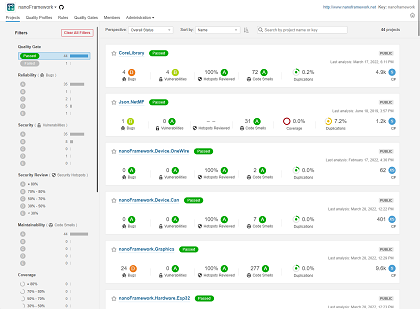
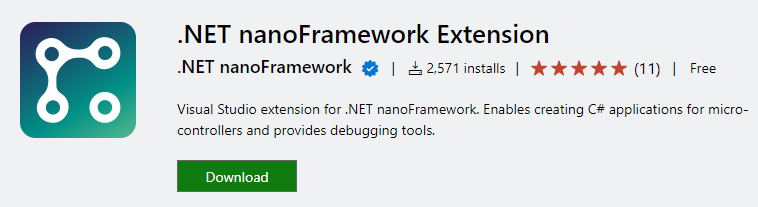
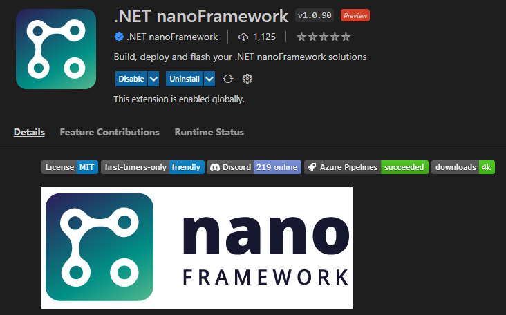
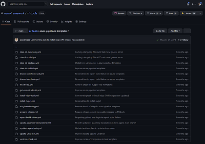
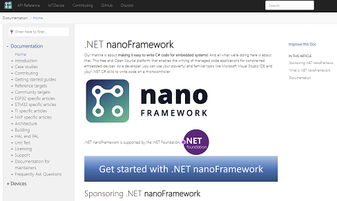

# Engineering fundamentals

Engineering fundamentals are defined with elements like proper code review, tests, documentation, CI/CD, design and execute with security and safety by default, developer experience and more! The great news is that .NET nanoFramework has all of this.

Here are some proof points.

## PR reviews and code quality

Everything goes thru PR, as it's a community effort, some key core contributors have merge rights and deeply review the PR but we also see PR reviewed by other community members. High quality PR are proposed by community developers and about 80 different contributors are raising PR every year.

3954 PR (see [Github statistics](https://github.com/pulls?q=is%3Apr+created%3A%3E%3D2021-06-03+user%3Ananoframework)) in total has been created in the last year period in the .NET nanoFramework repositories. Some has been created either by the bot (684) either are related to git actins (1907). **So 1363 created by real humans** every year. That's an average of **2.7 PR every single day of the year**!

On the code quality side, linters are used for our native C and C++ code. Linters are used for the documentation as well making sure our key Markdown files are properly formed.

.NET nanoFramework broadly uses SonarCloud as a static analyzer. Read more [here](https://www.nanoframework.net/sonarcloud-is-on-nanoframework-repos/). This increases the quality of the code by finding patterns that may not be the best, pointing out code that is repeated and should be reused, readability and more! All our .NET nanoFramework projects can be [found here](https://sonarcloud.io/organizations/nanoframework/projects).

## Developer Experience

This is the mantra of .NET nanoFramework: making the developer experience the best as possible. It does include a [Visual Studio extension](https://marketplace.visualstudio.com/items?itemName=nanoframework.nanoframework-vs2022-extension&ssr=false#review-details) allowing the create, build and debug the C\# code in the same way as you'll do with any of your C\# code! Tools to flash the device are available, they are always evolving to make it simpler to use.

Recently, an experimental [VS Code extension](https://github.com/nanoframework/nf-VSCodeExtension)) has been made available with support to flash, build and deploy .NET nanoFramework code on [Linux and MacOS](<https://www.nanoframework.net/vs-code-extension-for-net-nanoframework) on top of the Windows platform.

[Dev containers](https://code.visualstudio.com/docs/remote/create-dev-container) has been created to make it easy for anyone to rebuild the .NET nanoFramework native part. Making it easy to add your own native code.

## CI/CD: Azure DevOps and Git Actions

The best duo ever: all our build pipelines and nuget publish are running using Azure DevOps. A [specific tool repository](https://github.com/nanoframework/nf-tools) contains yaml file to be reused. Fixing a bug in this repo will fix the bug everywhere! Still each repository have a yaml file for what is specific which does include what needs to be build, some specific dependencies as well.

For the nuget update on dependent repositories, Git Actions is used. To give an idea, in the last rolling year, 1907 automatic updates has been done by Git Actions maintaining proper versions on all the nuget for all the repositories saving a lot of complicated and manual work.

## Security and safety by default

.NET nanoFramework supports TLS and SSL to connect over the network. Secrets can be stored on the device and for those offering a secure storage for Wi-Fi for example, .NET nanoFramework supports this. And while Over the Air update is not yet available, patterns to properly update your code using Azure IoT is available and detailed in [this article](https://www.nanoframework.net/over-the-air-net-nanoframework-code-update-using-azure-iot/).

## Test framework

A nice addition from 2021 allows to have unit tests. Those unit tests can be run in a pipeline as well as on a real device. A deep integration has been done with Visual Studio making the developer life as easy and smooth as possible. Some of the challenges that need to be solved are explained in this article published on the [Microsoft .NET blog](https://devblogs.microsoft.com/dotnet/show-dotnet-build-your-own-unit-test-platform-the-true-story-of-net-nanoframework/).

Adding those unit tests and implementing thousands of those for the Core Library and many other classes put a huge boost in terms of quality. While the Core Library had to be released almost every week 2 years ago, the actual rhythm is less than once a month as it has reach a great quality level.

Since it appeared, the test framework has been improved and recently added Data Raw feature allowing to write even more tests in a more efficient way.

## Documentation

.NET nanoFramework pays a huge attention to the documentation. The mechanism behind is describe in this article: [.NET nanoFramework ❤️(automated) documentation – .NET nanoFramework](https://www.nanoframework.net/net-nanoframework-love-automated-documentation/). The [documentation website](https://docs.nanoframework.net/) is automatically build, gathering all the 80+ nanoFramework repository, build the intellisense comments out of the code, gathering the IoT Device repository readme and putting all this together in a nice, digestible and easy to search way.

A specific attention has been placed as well on repositories like the [Azure Library one](https://github.com/nanoframework/nanoFramework.Azure.Devices) with all the details on how to use the library and of course with [dedicated samples](https://github.com/nanoframework/samples#azure-specific) in the sample repository.

## Observability

Being able to log information regarding your application is an important fundamental. .NET nanoFramework provides multiple nugets to adjust as best as possible with your needs. There is of course a regular debug one, outputting the details into the [debug console](https://www.nuget.org/packages/nanoFramework.Logging/). There are as well [Stream](https://www.nuget.org/packages/nanoFramework.Logging.Stream/), [Serial](https://www.nuget.org/packages/nanoFramework.Logging.Serial/) and [Syslog](https://www.nuget.org/packages/nanoFramework.Logging.Syslog/) available. This gives the opportunity to log any kind of information to the most common outputs. And if this is not enough for you, the base class can be extended and you can build the logging you need. And all this is based on the same set of API as the classical Microsoft.Extensions.Logging! So as a developer, one more time, you're covered and you can use the same way the tools you are use to use in .NET.

## Community engagement and support

.NET nanoFramework is built on Community and Community support. While there are possibility to get proper [paid technical support for enterprises using .NET nanoFramework](https://docs.nanoframework.net/content/support/professional-support.html), the build from Community nature of the project makes it a Community first project. There is a [very active Discord](https://discord.gg/NhDC3t8d) with multiple channels dedicated to help anyone. It is notable to see that the average answer for any question is usually less than one hour. And the base of participants is growing at a rhythm of more than a 100 new joiners every month for the last few years. More than 30% of our members are actively participating to discussions every month! There are more than 2000 messages exchanged every month on the server as well. This also shows a very active and healthy Community engagement.

## Conclusion

Over the last 4 weeks we've been trying to give you a tour of .NET nanoFramework and we hope you enjoyed it! There is more to say of course and we'll be happy to welcome you in our community.

